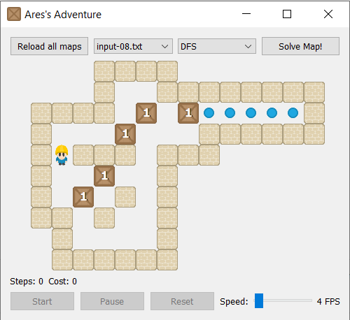

# CS420 AI Ares Adventure - Sokoban Puzzle Solver

A comprehensive Sokoban puzzle solver implementing multiple search algorithms with an interactive PyQt5 visualization interface. This project demonstrates various AI search techniques including DFS, BFS, UCS, and A* algorithms applied to the classic Sokoban (warehouse keeper) puzzle game.



## What is Sokoban?

Sokoban is a classic puzzle game where the player controls a warehouse keeper (@) who must push boxes ($) onto designated goal positions (.) within a maze-like warehouse. The challenge lies in the strategic planning required, as boxes can only be pushed (not pulled) and can easily become stuck in corners or against walls.

## Features

- **Interactive GUI**: PyQt5-based visualization with real-time solver execution using multiple search algorithms: DFS, BFS, UCS, A*
- **Batch Testing**: Automated testing framework for algorithm comparison

## Project Structure

```
├── src/
│   ├── main.py          # Main application with GUI and solver implementations
│   └── test.py          # Batch testing and performance analysis
├── input/               # Puzzle map files
├── output/              # Solution output files
├── asset/               # Game sprites and graphics
├── images/              # For README.md reference
├── experiment/          # Experimental maps and test cases
├── docs/
│   └── report.pdf       # Our report regarding this project
├── requirements.txt     # Python dependencies
└── README.md            # This file
```

## Prerequisites

- Python 3.7 or higher
- pip package manager

## Installation

1. **Clone the repository**:
   ```bash
   git clone https://github.com/lamlethanh777/CS420-AI-Ares-Adventure.git
   cd CS420-AI-Ares-Adventure
   ```

2. **Install dependencies**:
   ```bash
   pip install -r requirements.txt
   ```

## Running the Application

### Algorithms Simulation
```bash
python src/main.py
```

This launches the interactive GUI where you can:
- Select different puzzle maps from the dropdown
- Choose solving algorithms
- Visualize the solution step-by-step
- Adjust playback speed
- View performance metrics

### Testing Script
```bash
python src/test.py
```

This runs performance comparisons across multiple algorithms and maps, generating:
- Runtime analysis graphs
- Memory usage comparisons
- Node generation statistics
- Solution quality metrics

### Adding New Maps
1. Create a new `.txt` file in the `input/` directory
2. Follow the map format specification below

#### Map Format

Input maps use the following symbols:
- `#`: Wall
- ` `: Empty floor
- `@`: Player starting position
- `$`: Box
- `.`: Goal position
- `+`: Player on goal
- `*`: Box on goal

Example map:
```
############
#.         #
# #    $   #
# @        #
############
```

## Reference

- Book: Artificial Intelligence: A Modern Approach, 4th US ed. by Stuart Russell and Peter Norvig
- CS420 slides from Dr. Nguyen Ngoc Thao
- Sokoban sprite assets: 1001.com

## Contributors

| Student ID | Full Name         |
| :----------- | :---------------- |
| **22125046** | **Lê Thanh Lâm** |
| **22125058** | **Lê Phan Minh Khoa** |
| **22125096** | **Đoàn Công Thành** |
| **22125102** | **Nguyễn Chính Thông** |